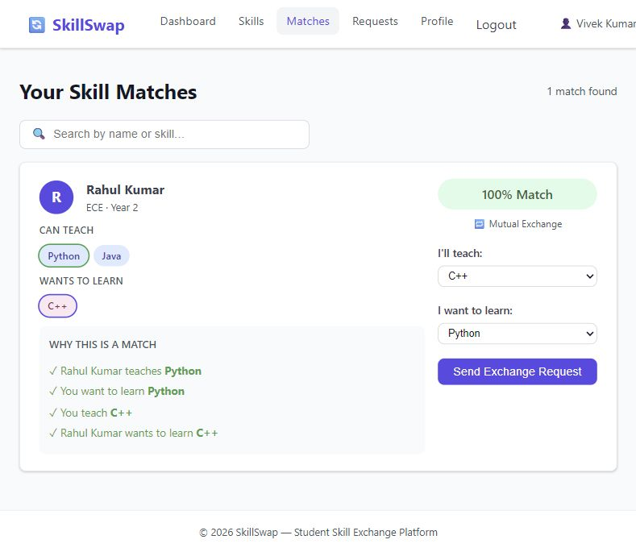

# 🔄 SkillSwap — Student Skill Exchange Platform

> A web-based platform where students list skills they can **teach** and skills they want to **learn**. The system finds **compatible students** and enables skill-exchange requests.

---

## 💡 Core Feature — Two-Way Skill Matching

```
Student A teaches: C++, HTML       Student B teaches: Python, Java
Student A wants:   Python, Git     Student B wants:   C++

→ A wants Python  ✓  B teaches Python
→ B wants C++     ✓  A teaches C++

MUTUAL MATCH = 100%
```

The matching algorithm is rule-based, transparent, and explainable — not a black-box AI.



Demo screenshots: [Landing](docs/screenshots/landing.jpg) ·
[Accepted exchange](docs/screenshots/accepted-request.jpg) ·
[Admin dashboard](docs/screenshots/admin-dashboard.jpg).

---

## 🛠️ Tech Stack

| Layer | Technology |
|---|---|
| Frontend | HTML5, CSS3, JavaScript (vanilla) |
| Backend | PHP 8+ |
| Server | Apache via XAMPP |
| Storage | Flat `.txt` files (pipe-delimited) |
| Version control | Git + GitHub |

---

## 📁 Project Structure

```
SkillSwap/
├── index.php           Landing page
├── login.php           Student / admin login
├── register.php        Student registration
├── logout.php          Session destroy
├── dashboard.php       Student dashboard
├── profile.php         Edit profile
├── skills.php          Add / remove skills
├── matches.php         View skill matches
├── requests.php        Send / accept / reject requests
│
├── admin/
│   ├── dashboard.php   Admin stats
│   ├── users.php       Manage students
│   └── requests.php    View all requests
│
├── includes/
│   ├── functions.php   ← ALL data layer functions (single source of truth)
│   ├── auth.php        Session helpers
│   ├── header.php      Shared nav
│   └── footer.php      Shared footer
│
├── css/style.css
├── js/script.js
│
├── data/
│   ├── seed/           Synthetic, versioned demo fixtures
│   └── runtime/        Local records, generated on first use and Git-ignored
├── tests/              Regression, HTTP flow and concurrency checks
├── tools/              Development router and explicit demo reset
├── docs/DEMO.md        Demo walkthrough and verification checklist
└── .github/workflows/php.yml   Automated PHP checks
```

---

## 🚀 Local Setup (XAMPP)

```bash
# 1. Clone the repo
git clone https://github.com/0xViivek/SkillSwap.git

# 2. Move into XAMPP's web root
#    Copy/move the SkillSwap folder to:
#    C:\xampp\htdocs\SkillSwap\

# 3. Start Apache in XAMPP Control Panel

# 4. Open in browser
http://localhost/SkillSwap/

# 5. Verify from the repository root (PHP must be on PATH)
php tests/run.php
# Node 18+ is needed for the HTTP and concurrency suites
node tests/http.cjs
node tests/concurrency.cjs
```

PHP requires `mbstring`. The `data/runtime` folder must be writable by PHP;
synthetic fixtures are copied there automatically. Apache must honor the
included `.htaccess` files (`AllowOverride All`, `mod_authz_core` and `mod_rewrite`). Verify that direct requests
to `/SkillSwap/data/seed/users.txt` and `/SkillSwap/data/runtime/users.txt`
return **403** before serving the app beyond your own computer.

For the development-server alternative, Windows commands, demo/reset steps,
manual mobile checks and current limitations, see [the demo guide](docs/DEMO.md).

The matching score is a rule-based label: **100%** means both skill directions
match; **50%** means one direction matches. Sending an exchange requires both
directions. Accepted requests expose an email link to the exchange partner.

## Validation and data safety

- CSRF tokens protect POST actions, including logout.
- Login rotates session IDs; session cookies use HttpOnly and SameSite=Lax.
- Skill deletion checks ownership; exchange actions validate participants,
  matching skills, receiver ownership and pending status.
- Stored text rejects pipe/newline injection. A shared data lock serializes
  ID generation, duplicate checks and complete mutations.
- Runtime records are ignored by Git. `data/seed` contains demo fixtures only.
- GitHub Actions checks PHP syntax, regression tests, HTTP flows and concurrent
  registrations on PHP 8.0 and 8.3.

This remains an academic demo. Multi-file rollback does not provide crash-safe
database transactions; database migration and backups are needed for deployment
at larger scale.

---

## 🔑 Demo Accounts (seed data)

| Role | Email | Password |
|---|---|---|
| Admin | admin@skillswap.com | password |
| Student | vivek@gmail.com | password |
| Student | rahul@gmail.com | password |

---

## 🌿 Branch Strategy

| Branch | Owner | Purpose |
|---|---|---|
| `main` | Member 1 | Production-ready code only |
| `feature/auth` | Member 2 | Login, Register, Logout |
| `feature/skills` | Member 3 | Profile, Skills CRUD |
| `feature/matching` | Member 1 | Matching engine, Match page |
| `feature/exchange` | Member 4 | Requests (send/accept/reject) |
| `feature/ui-admin` | Member 5 | Landing page, CSS, Admin pages |

**Workflow:**
```bash
git pull origin main            # always before starting work
git checkout feature/your-branch
# ... code ...
git add .
git commit -m "feat: description"
git push origin feature/your-branch
# open Pull Request → Member 1 reviews → merge to main
```

---

## 📅 4-Day Plan

| Day | Goal |
|---|---|
| Day 1 | Foundation: auth, sessions, profile, skills CRUD, .txt layer |
| Day 2 | Matching engine, match score, match results page |
| Day 3 | Exchange requests, admin dashboard |
| Day 4 | 🔒 Feature freeze — bug fix, UI polish, demo prep, PPT |

---

## 👥 Team

| Member | Role | Module |
|---|---|---|
| Member 1 | Project Lead | Architecture · Matching · Integration |
| Member 2 | Auth | Login · Register · Sessions |
| Member 3 | Skills | Profile · Skills CRUD · Browse |
| Member 4 | Exchange | Requests · Accept/Reject |
| Member 5 | UI / Admin | CSS · Landing · Admin pages |

---

## 🔮 Future Scope

- MySQL/MariaDB database migration
- Real-time chat between matched students
- Email notifications
- Ratings & reviews after exchanges
- AI-powered skill recommendations
- Mobile application
- College-wide deployment

---

## 📄 License

Academic project — built during a 15-day internship program.
